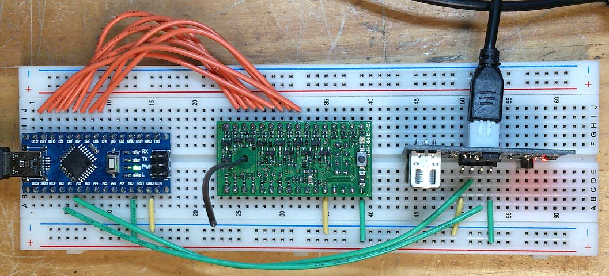
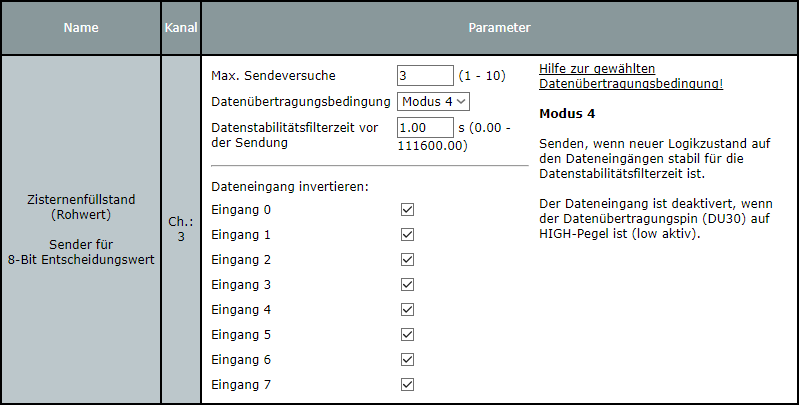
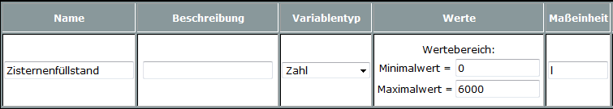
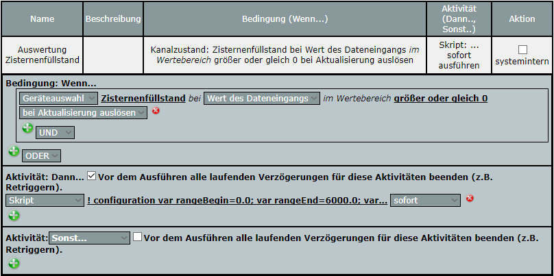

# HomeMatic Ultraschall-Füllstandsmessung

Mit wenigen Modulen kann eine Ultraschall-Füllstandsmessung für das [Hausautomationssystem HomeMatic](http://www.homematic.com/) realisiert werden.

## Details
 
* Eine aufwändige Messwertvorverarbeitung sorgt für einen stabilen Messwert mit einer hohen Genauigkeit.
* Durch die fast vollständige Ausnutzung der 8 Bit des Sendemoduls ergibt sich eine maximale Abweichung von 0,2%. Bei einer 6000l Zisterne bedeutet das eine maximale Abweichung von nur 12l.
* Ein spezieller Fehlerwert (255) kennzeichnet eine fehlerhafte Messung oder einen defekten Sensor.

## Bauteileliste

* Arduino Nano V3
* HomeMatic 8-bit Sendemodul (HM-MOD-EM-8Bit)
* Ultraschall-Modul mit wasserdichtem Sensor (Liste siehe unten)
* USB-Netzteil inkl. Mini-USB-Kabel

### Mögliche Ultraschall-Module

(Die Angaben sind ungeprüft aus dem Internet zusammengetragen.)

|Typ|Min. Abstand [cm]|Max. Abstand [cm]|Auflösung [mm]|Öffnungswinkel [°]|Bemerkungen|
|:---:|:---:|:---:|:---:|:---:|:---:|
|JSN-SR04T bzw. TE501|25|450|5|<50|Wasserdichter abgesetzter Sensor; im Einsatz beim Autor|
|US-100|2|450|1|<15|angeblich temperaturkompensiert|
|HY-SRF05|2|450|2|<15||
|HC-SR04|2|450|3|<15||

## Verschaltung der Module

Anschluss Ultraschall-Modul:

|JSN-SR04T|Arduino Nano|
|:---:|:---:|
|5V|5V|
|Trig|A0|
|Echo|A1|
|GND|GND|

Anschluss HomeMatic-Sendemodul:

|HM-MOD-EM-8Bit|Arduino Nano|
|:---:|:---:|
|3,5-12V|5V|
|GND|GND|
|IN1|8 (PB0)|
|IN2|9 (PB1)|
|IN3|10 (PB2)|
|IN4|11 (PB3)|
|IN5|12 (PB4)|
|IN6|5 (PD5)|
|IN7|6 (PD6)|
|IN8|7 (PD7)|

Prototypischer Aufbau:



## Montage Ultraschallsensor

Folgendes ist bei der Montage des Ultraschallsensors zu beachten:
* Unbedingt den minimalen Abstand zur Wasseroberfläche für das verwendete Ultraschallmodul beachten (z.B. 25cm für JSN-SR04).
* Vor dem Ultraschallmodul muss der Messkegel frei von Hindernissen sein.
* Die Reflexionsfläche (Wasseroberfläche) muss senkrecht zur Achse des Ultraschallmoduls sein.

## Programmierung Arduino Nano

Der [Sketch levelsensor.ino](levelsensor/levelsensor.ino) ist entsprechend dem Anwendungsfall zu konfgurieren und auf den Arduino Nano zu laden. Dafür wird die [Arduino IDE](https://www.arduino.cc/en/main/software) benötigt.

### Konfiguration

Am Anfang des Sketches befinden sich etliche Konfigurationsoptionen. Folgende Optionen müssen mindestens für die eigene Anwendung angepasst werden:

|Name|Einheit|Bedeutung|
|---|---|---|
|AIR_TEMPERATURE|°C|Lufttemperatur im Tank|
|AIR_HUMIDITY|%|Luftfeuchtigkeit im Tank|
|DISTANCE_RANGE_BEGIN|m|Messbereichsanfang: Abstand vom Boden des Tanks bis zum Sensor. Es wird maximal 5,50m unterstützt.|
|DISTANCE_RANGE_END|m|Messbereichsende: Abstand der Wasseroberfläche des voll gefüllten Tanks bis zum Sensor. Es ist der Mindestabstand des eingesetzten Ultraschallmoduls zu beachten.|
|DISTANCE_OFFSET|m|Korrekturoffset für das eingesetzte Ultraschallmodul. Dieser Wert wird zum gemessenen Wert hinzuaddiert.|

### Testen des HomeMatic-Sendemoduls

Um nur das HomeMatic-Sendemodul zu testen, kann der [Sketch transmittertest.ino](transmittertest/transmittertest.ino) verwendet werden. Dieser Sketch sendet verschiedene Bit-Muster an das HomeMatic-Modul.

## Projektierung CCU

### Konfiguration Sendemodul

Der Kanal 3 vom Sendemodul muss wie folgt eingestellt werden:



#### Hinweis 

Der Satz "Der Dateneingang ist deaktivert, wenn der Datenübertragungspin (DU30) auf HIGH-Pegel ist (low aktiv)." trifft nicht zu. In diesem Anwendungsfall ist DU30 auf HIGH-Pegel und das Modul sendet bei Änderung der Dateneingänge trotzdem. Im Benutzerhandbuch ist das Sendeverhalten für Mode 4 richtig beschrieben: "Datenübertragungseingang HIGH -> Auswertung EIN".

### Systemvariable

Anzulegende Systemvariable:



### Programm

In der CCU ist folgendes Programm für die Messwertauswertung zu erstellen:



Folgendes Skript ist im Dann-Zweig einzutragen. Die Konfiguration (mindestens die Optionen _rangeBegin_ und _rangeEnd_) ist entsprechend dem Anwendungsfall anzupassen:

```
! configuration
var rangeBegin=0.0;
var rangeEnd=6000.0;
var precision=0;
var errorValue=-100.0;
var sysVarName="Zisternenfüllstand";

! read device data point and update system variable
var sv=dom.GetObject(ID_SYSTEM_VARIABLES).Get(sysVarName); 
var src=dom.GetObject("$src$");
if (sv && src) {
    var val=src.State();
    if (val==255) {
      sv.State(errorValue);
    } else {
      val=(((rangeEnd-rangeBegin)*val)/254.0)+rangeBegin;
      sv.State(val.Round(precision));
    }
}
```

Eine ungültige Messung kann bei Bedarf auch anders behandelt werden. Anstatt `sv.State(errorValue);` kann eine beliebige andere Aktion ausgeführt werden. Beispiele:
* Ungültige Messung ignorieren.
* Alarmvariable setzen.

## Fehlersuche

### Häufige ungültige Messungen

Falls häufig ungültige Messungen (Wert 255) signalisiert werden, können schrittweise folgende Optionen angepasst werden:

1. *NUM_SKIP_ECHOES* auf 3 erhöhen. Dadurch wird länger abgewartet bis unerwünschte weitere Echos eines Pings abgeklungen sind.
2. *NUM_SAMPLES* auf 15 erhöhen. Dadurch werden mehr Pings für eine Messung ausgeführt.
3. *DISTANCE_GOOD_QUALITY* auf 0.03 erhöhen. Dadurch wird der Gutbereich für Pings vergrößert. Die Messwertgenauigkeit sinkt dadurch.
4. *NUM_GOOD_SAMPLES* auf 3 verringern. Dadurch werden weniger gute Pings für einen gültigen Messwert benötigt. Die Messwertgenauigkeit sinkt dadurch.

